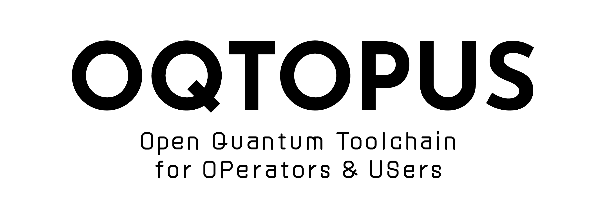

# artwork

## Overview

This repository contains artwork for the [OQTOPUS](https://oqtopus-team.github.io/) project.
For details on use of the artwork, please see the [style guide](OQTOPUS_GUIDELINES.pdf).

- AI: [Adobe Illustrator files](./AI/)
- PNG: [PNG files](./PNG/)
- SVG: [SVG files](./SVG/)

## Logo

<table>
    <tr>
        <th colspan="7"></th>
    </tr>
    <tr>
        <th></th>
        <th colspan="3">PNG</th>
        <th colspan="3">SVG</th>
    </tr>
    <tr>
        <th></th>
        <th>horizontal</th>
        <th>vertical</th>
        <th>symbol</th>
		<th>horizontal</th>
        <th>vertical</th>
        <th>symbol</th>
    </tr>
    <tr>
        <th>color with transparent</th>
        <td></td>
		<td></td>
		<td></td>
		<td></td>
		<td></td>
		<td></td>
    </tr>
    <tr>
        <th>black with transparent</th>
		<td></td>
		<td></td>
		<td></td>
		<td></td>
		<td></td>
		<td></td>
    </tr>
	<tr>
		<th>white with transparent</th>
		<td></td>
		<td></td>
		<td></td>
		<td></td>
		<td></td>
		<td></td>
    </tr>
	<tr>
        <th>color with background</th>
    	<td></td>
		<td></td>
		<td></td>
    </tr>
	<tr>
		<th>black with background</th>
		<td></td>
		<td></td>
		<td></td>
    </tr>
	<tr>
		<th>white with background</th>
		<td></td>
		<td></td>
		<td></td>
    </tr>
</table>

## LogoType

<table>
    <tr>
        <th colspan="7"></th>
    </tr>
    <tr>
        <th></th>
        <th>PNG</th>
        <th>SVG</th>
    </tr>
    <tr>
        <th>transparent</th>
        <td></td>
        <td></td>
    </tr>
    <tr>
        <th>with background</th>
        <td></td>
        <td></td>
    </tr>
</table>

## Favicons

<table>
    <tr>
        <th colspan="7"></th>
    </tr>
    <tr>
        <th></th>
        <th>PNG</th>
        <th>SVG</th>
    </tr>
    <tr>
        <th>color with transparent</th>
        <td></td>
        <td></td>
    </tr>
    <tr>
        <th>color with background</th>
        <td></td>
        <td></td>
    </tr>
</table>

## License

This work is licensed under a [Creative Commons Attribution 4.0 International License](./LICENSE.md).
